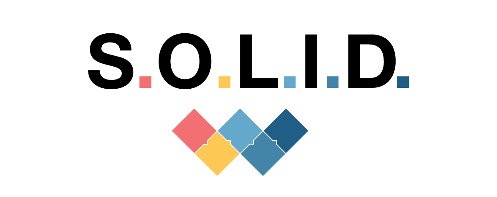

> SOLID is an  acronym that stands for **five key object-oriented design principles**  (OOD) created by Robert C. Martin (also known as Uncle Bob). Adopting these practices can also contribute to avoiding code smells, refactoring code, and Agile or Adaptive software development.
> In this repository are some **examples** of how you should implement these principles and some more examples of code that don't respect those principles.

-----------------------------------------------------------------
| examples             |       SOLID     |       NOT SOLID     |
| --------------------- | :-------------: | :-----------------: |
| Single Responsability | [S](SOLID/S.ts) | [F](NOT-SOLID/S.ts) |
| Open Closed           | [O](SOLID/O.ts) | [L](NOT-SOLID/O.ts) |
| Liskov Substitution   | [L](SOLID/L.ts) | [U](NOT-SOLID/L.ts) |
| Interface Segregation | [I](SOLID/I.ts) | [I](NOT-SOLID/I.ts) |
| Dependency Inversion  | [D](SOLID/D.ts) | [D](NOT-SOLID/D.ts) |
-----------------------------------------------------------------

<h2 id="p01">Single Responsability Principle</h2>

States that a class should only have one reason to change. This means that a class should have only one job and do one thing.

<h2 id="p02">Open Closed Principle</h2>

Objects or entities should be open for extension but closed for modification. This means that a class should be extendable without modifying the class itself.
It is open for extension: This means you can extend what the module can do.
It is closed for modification: This means you cannot change the source code, even though you can extend the behavior of a module or entity.

<h2 id="p03">Liskov Substitution</h2>

In 1987, the Liskov Substitution Principle (LSP) was introduced by Barbara Liskov in her conference keynote “Data abstraction”.
The principle defines that in an inheritance, objects of a superclass (or parent class) should be substitutable with objects of its subclasses (or child class) without breaking the application or causing any error.

<h2 id="p04">Interface Segregation</h2>

A client should never be forced to implement an interface that it doesn’t use, or clients shouldn’t be forced to depend on methods they do not use.

<h2 id="p05">Dependency Inversion</h2>

States that your classes should depend upon interfaces or abstract classes instead of concrete classes and functions. This makes your classes open to extension, following the open-closed principle.
